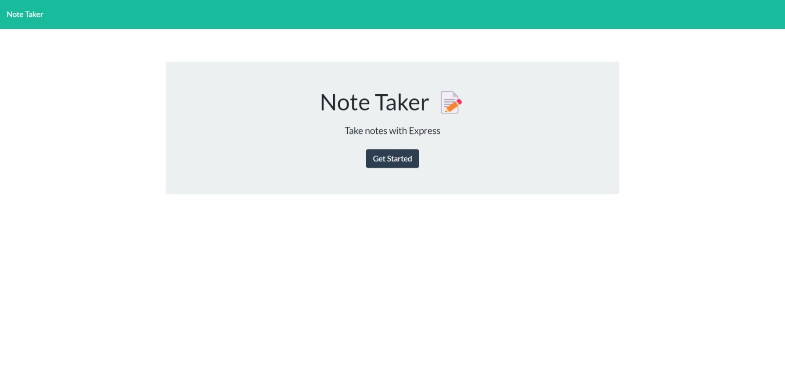

# Note-Taker

Homework-11: Note Taker

 

 

## Description:
---
Application that is used to write and save notes.

 

## Table of Contents:
---
- [License](#license)
- [Heroku](#heroku)
- [Installation](#installation)
- [Screenshots](#screenshots)
- [Contribution](#contribution)
- [Tests](#tests)
- [Credits](#credits)
- [Author](#author)

 

## License
---
- MIT License

 

## Heroku
---

 
 

## Installation:
---
To install please clone my repository at the github link provided below. In VSC run npm install in terminal then npm start.

 
 

## Screenshots:
---
[Screenshot](./images/note-taker-screenshot.jpeg) "NoteTaker homepage"

 
 

## Contribution:
---
If you wish to contribute you can email me at brettstephenhockridge@yahoo.com

 
 

## Tests:
---
npm init -y, npm install, and npm express.

 
 

## Credits:
---
Thank you to my instructors Jackie and Dave for helping me multiple times on this assignment.

 
 

## Author:
---
Brett Hockridge

 
 

## Github:
---
My github URL is [BroBrett](https://github.com/BroBrett)